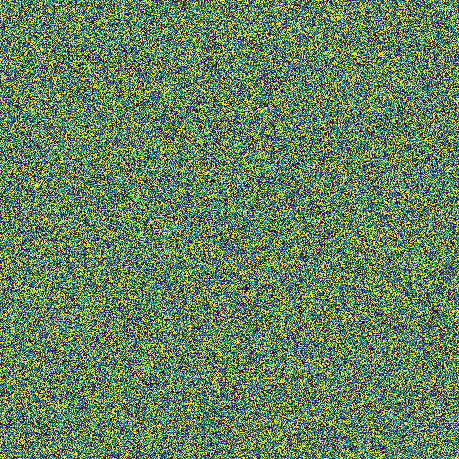

# Cosmic-Large-Scale-Structure-Generator
A diffusion‑model‑based generator for cosmic large‑scale structure.

The model was trained using **The Quijote simulations** data. (https://arxiv.org/pdf/1909.05273)

You can run the Python scripts to generate a 2D density field (PNG) or the full sampling evolution (GIF).

**Scale**: Each pixel represents a length of $1 \text{ Gpc}/h \div 256 = 3.91 \text{ Mpc}/h$.

<p align="center">
  
  <br>
  <i>Figure: Reverse diffusion process generating the 2D Cosmic Web structure.</i>
</p>

## 🌌 Overview
This repository implements a **Denoising Diffusion Probabilistic Model (DDPM)** to simulate the **Large-Scale Structure** of the universe.

The model learns to transform random Gaussian noise into realistic matter density fields, capturing the intricate network of filaments and voids known as the **Cosmic Web**.

## 🛠️ Key Features
- **Physics-Inspired**: Generates structures consistent with N-body simulation method.
- **Ready-to-run**: Includes pre-trained weights (`6MB`) and an automated sampling script.
- **Visualization**: Products final picture and also the dynamic demonstration of the reverse diffusion process.

## 🚀 Getting Started

### 1. Prerequisites (Windows/Linux/Mac)
Ensure you have Python 3.8+ installed. You can install the dependencies via:

```bash
pip install torch numpy matplotlib imageio imageio-ffmpeg

### 2. File Preparation
Download all script files: 
- ***unet.py*** (Model Architecture)
- ***utils_diffusion.py*** (Diffusion Logic)
- ***sample.py*** ,
and pre-trained weight:
***best_model.pt*** (Pre-trained Weights) ,
and put them in the **same directory**.

### 3. Products generating

If you only want .png file, you can run the following command:

```bash
python sample.py

If you also want all reverse diffusion process, you can run the following command to get the evolution animation:

```bash
python sample.py --gif
